# CoroChat
---
## Authors:     [Raphael Dray](www.linkedin.com/in/raphaeldray), [Thierry Khamphousone](www.linkedin.com/in/tkhamphousone)   
##### Diane Martin, Alexandre De Sevin, Eythan Dahan, Boris Houessou
---
> This program is a desktop application.  
> It integrates the client and the server which are communicating each other through HTTP Routes.  
> The client fetches and posts data from/to the server which returns JSON-Encoded responses.
> The client is a Whatsapp-Like application.
> The project was carried out using the scrum method.

> It's written in __Java programming language including some libraries like so:__
+ [JDBC Oracle DB](https://www.oracle.com/fr/database/technologies/appdev/jdbc.html)
+ [Java FX 11](https://openjfx.io/)
+ [JUnit 5](https://junit.org/junit5/)
+ [Animate FX](https://typhon0.github.io/AnimateFX/)
+ [JBcrypt](https://www.mindrot.org/projects/jBCrypt/)
+ [Gson](https://github.com/google/gson)

---

## Note: 
> To be able to launch the LoginView, you must configure javaFX  
> Go to:  Run > Edit configuration > LoginView > VM option
>
> Inside the VM option text zone in IntellJ, add the location of the javaFX library as the example below:

    --module-path 
    /Path/To/javafx-sdk-11.0.2/lib 
    --add-modules 
    javafx.controls,javafx.fxml

---

## Presentation: 

How does CoroChat desktop app works ? 
We chose to show an use case where three users will connect and chat together.
> Thierry Khamphousone : Yulypso
> Raphaël Dray : MrrRaph
> Felicia Ionascu : FeliciaIonascu

### Main menu
Here is the main menu where users can sign in or go to sign up panel. 
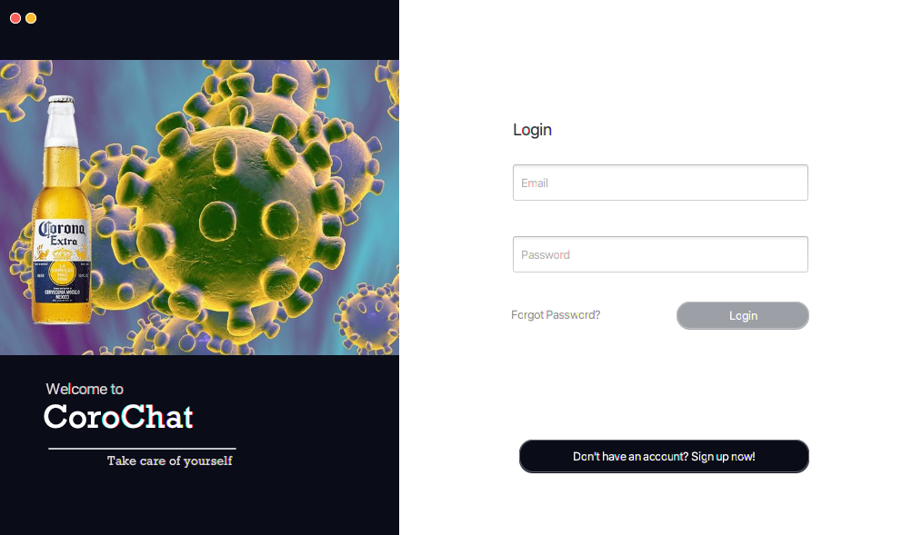

### Sign up 
Thierry would like to access the CoroChat room. Firstly, he has to sign up. 
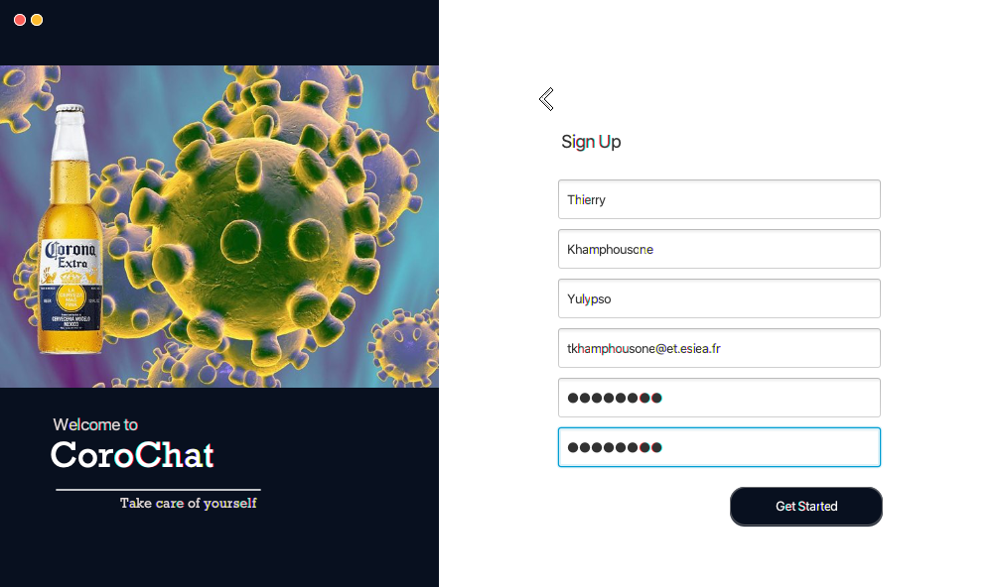

> Check:
> first name: cannot contains number
> last name: cannot contains number
> email: email format without capital letters
> pseudo: Cannot start with a number
> password: must contains at least 1 lowercase letter, 1 uppercase letter, 1 number and 1 special character

Press "Get started to sign up".

If an user tries to create an account with an existing email or pseudo, a pop up appears to alert the user.

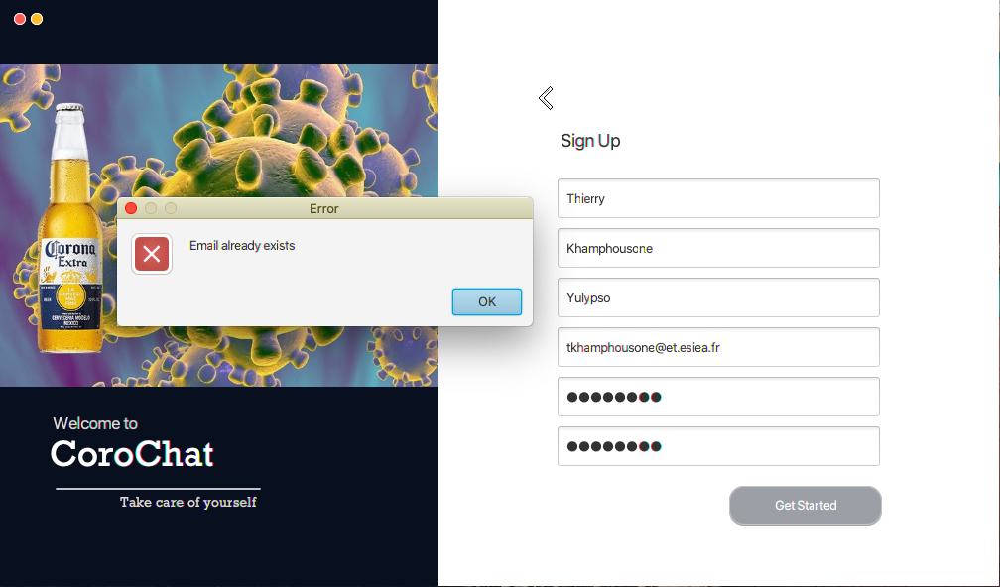

> Email already exists.

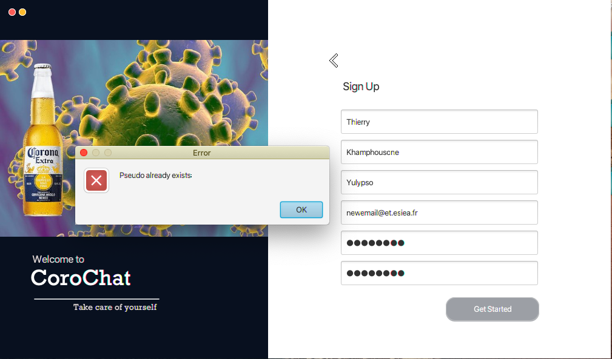

> Pseudo already exists.

Data are stored in the Oracle Database.

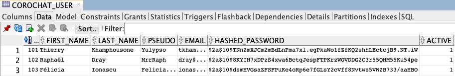
> 3 lines has been added for our three users
> Password are secure thanks to the blowfish encryption
---

### Connect from the login view
For an existing account, the user can connect on the CoroChat room from the Login View thanks to his email and password.

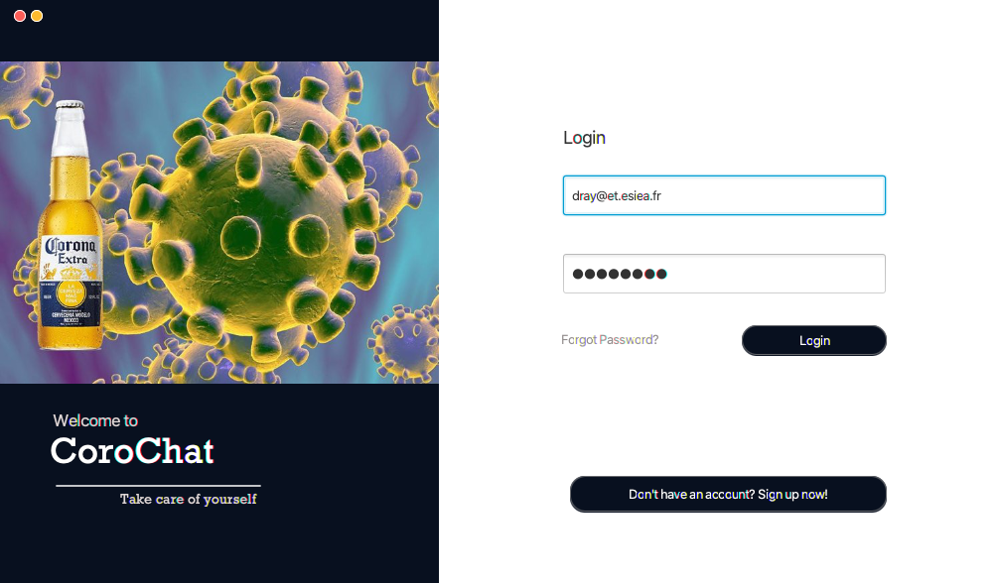

If an user with the same email is already connected a pop up appears to alert the user.

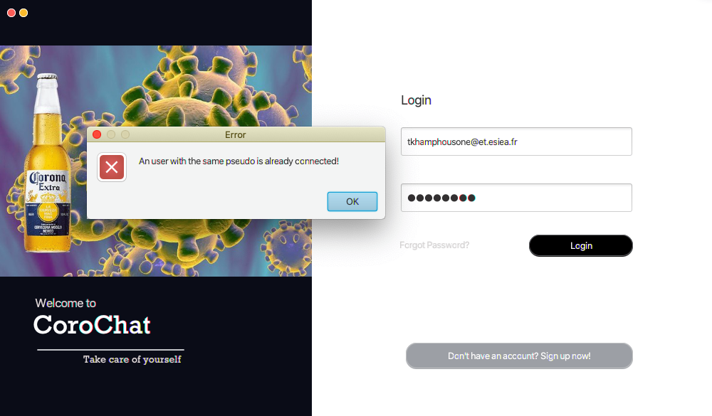

---
 
### CoroChat Room
Our three users are now connected on the CoroChat room. They will now try to communicate through the interface.
 
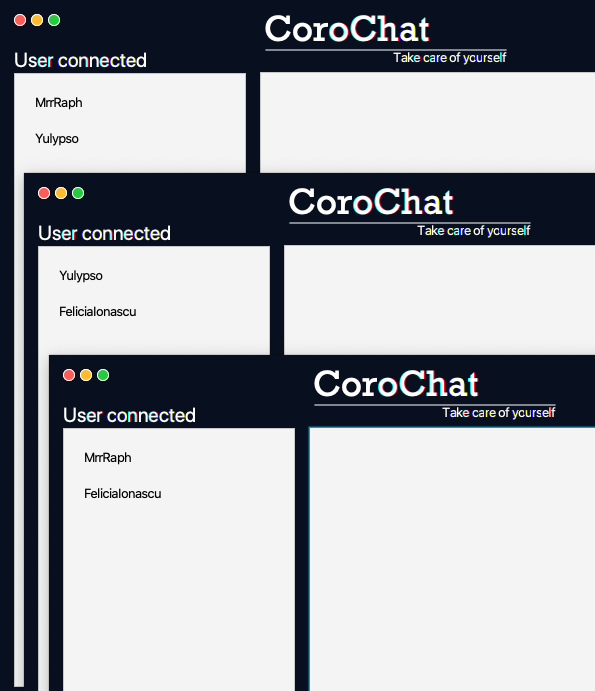

FeliciaIonascu starts by sending a message. 

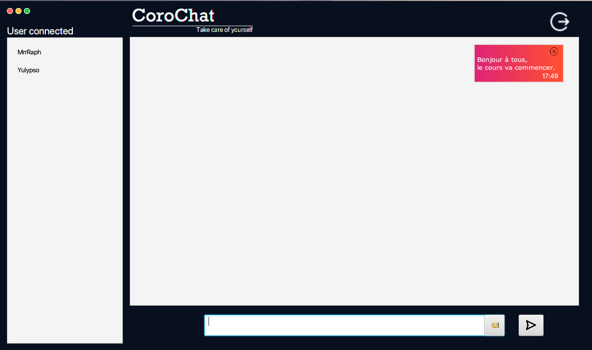

Then Yulypso and MrrRaph reply. 

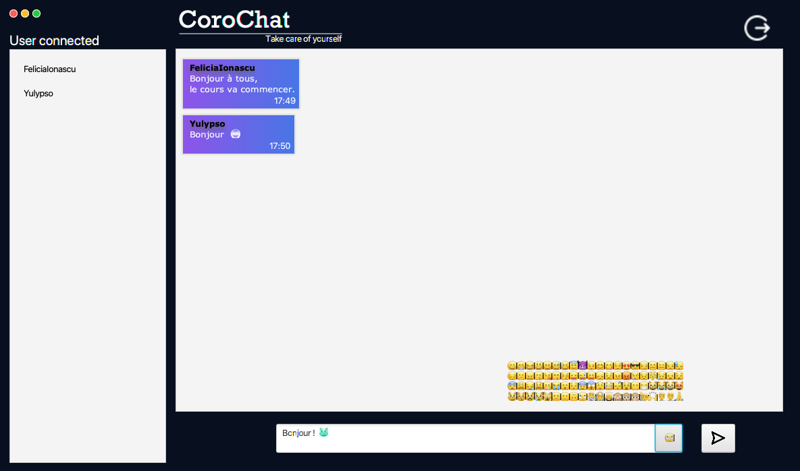
> You can use emoticon to communicate your feeling like MrrRaph!

FeliciaIonascu wrote something wrong by mistake: "OrientEEEE" and now she is trying to delete the message.

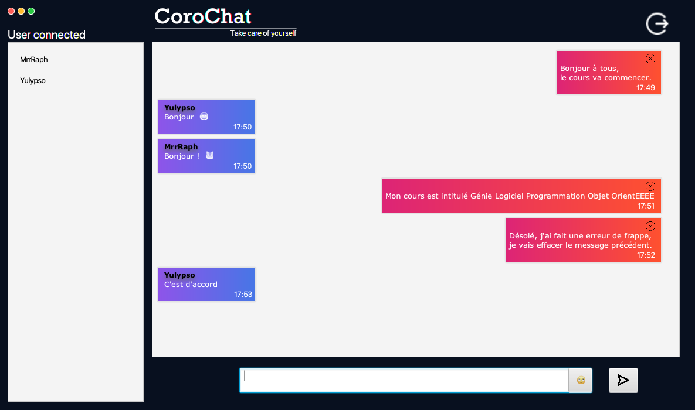

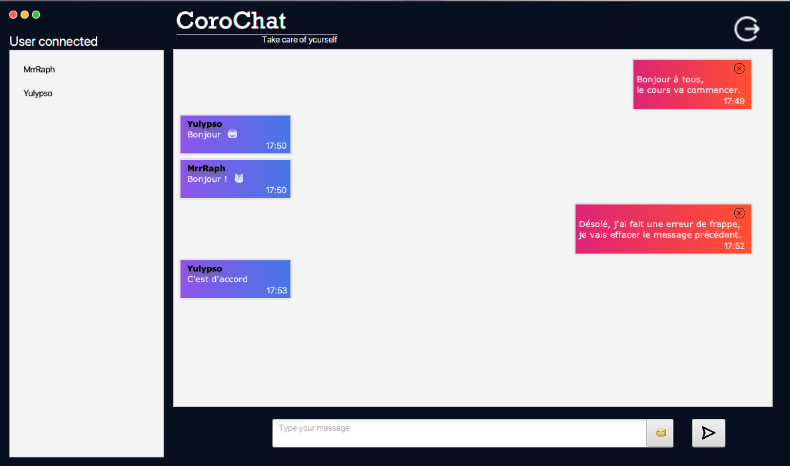

Here we can find out that the message has been correctly deleted from the database.

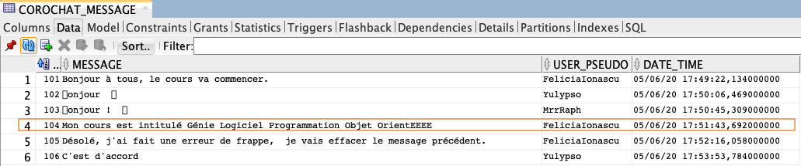

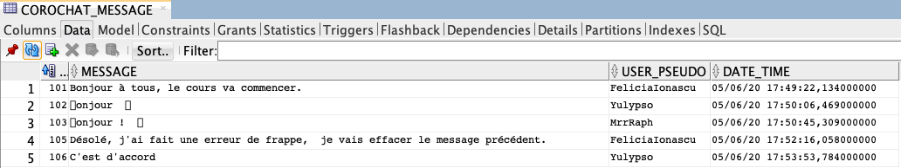

---

### Disconnect
Now the users would like to disconnect from the CoroChat room. 

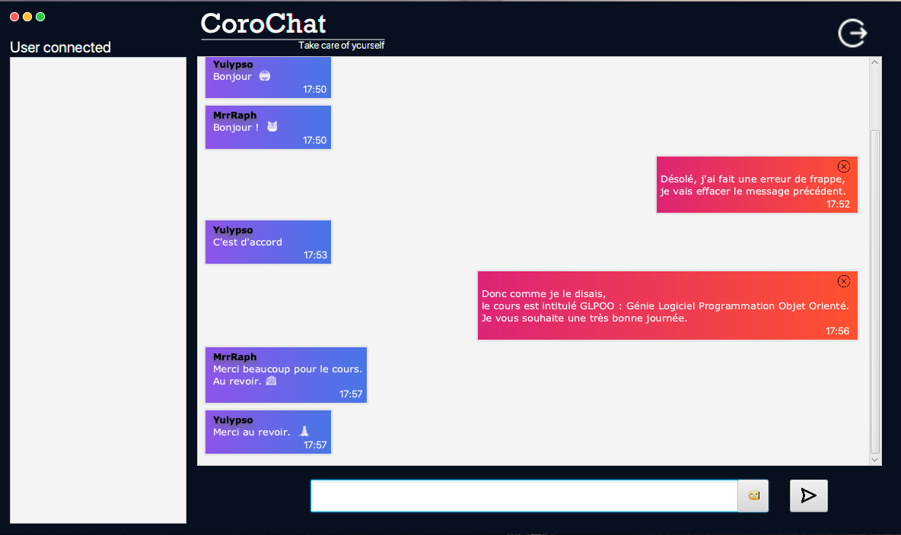

> to disconnect, each user has to click on the top right button.
> to leave the app, each user has to click on the top left red button.
> to reduce the screen, each user has to click on the top yellow button.

After this, disconnected users are back to the Login panel.

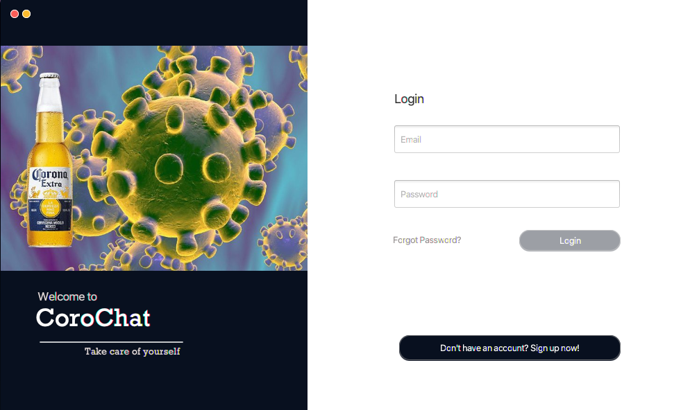

---

### Logger
Within our project source code, we added a logger to log every information, warning or errors. 
Here are some examples. 

> logger in the server INFO
> INFO: information about what happened

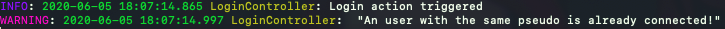

> logger in the client INFO and WARNING
> INFO: information about what happened
> WARGNIN: Client error

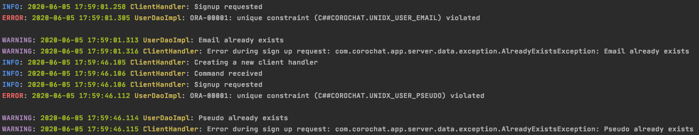

> logger in the client INFO, WARNING and ERROR
> INFO: information about what happened
> WARNING: Client error
> ERROR: Databse error

---
### Technical debt

+ We could not implement the .jar executable from the mvnw script, so we provided it with the IntellJ build.

---
## Last Release Version: 0.0.8
### Changelog:
> #### Version 0.0.8
> Refactored modules between client and server.
---
> #### Version 0.0.7
> Added Unit Tests.  
---
> #### Version 0.0.6
> Added Logger interface with its implementation for logging information as well as in console and in a file stored on the server/client.
---
> #### Version 0.0.5
> Added JavaDoc inside all the classes
---
> #### Version 0.0.4
> Added client commands for deleting messages.  
> Added popup for informing the user when error on the login view.  
> Added the Message model for storing messages in the database.  
> Added MessageRepository to the AbstractCorochatDatabase.  
> Added Dao and its helpers for communicating with the message table.
> Added the button over our own message for deleting them.  
> Added methods inside the chat controller for interacting with the other users in case of connecting, deleting, sending actions.
---
> #### Version 0.0.3
> Refactored design colors from linear gradient violet to darkblue.  
> Added support for OS validations.  
> Added second view ChatView and its ChatController for performing action on the Chat view.  
> Refactored LoginController and added connection between the server and the view.  
> Refactored MultiThreadedServer class.  
> Refactored classes in the data package.  
> Added new Index for handling pseudo duplication in the database.  
---
> #### Version 0.0.2
> Added UserDao interface containing abstract sql methods to interact with the DB.  
> Added DataUserName class containing the names of the user columns and the table name.  
> Added AbstractCorochatDatabase defining abstract dao method and connecting the server to the Oracle DB by the Singleton design pattern.  
> Added UserRepository in order to interact asynchronously with the Oracle DB for the user table.  
> Implemented UserDao and AbstractCorochatDatabase:
> * UserDaoImpl implements UserDao sql methods to interact with the Oracle DB user table.
> * CorochatDatabase extends AbstractCorochatDatabase with a Singleton design pattern and use himself as an implementation for instantiating a database.
---
> #### Version 0.0.1
> Added LoginView fxml created with SceneBuilder 2.0, the design of the Login view.  
> Added Utils to handle email validation and password complexity and helpers for JavaFX.  
> Added UserModel to instantiate it in further.
> Added LoginView JavaFX java class screen.
> Added LoginController to handle actions on the LoginView.